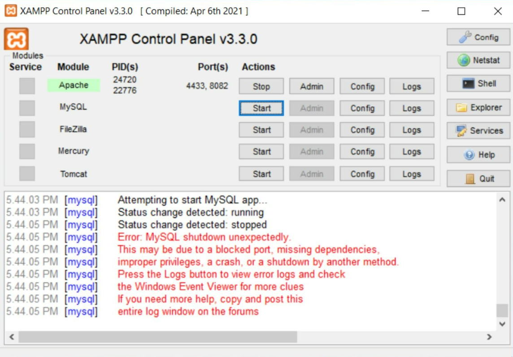
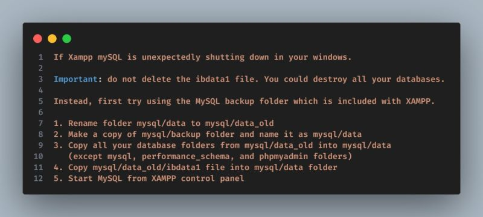

# Techscription XAMPP Mechanic

🔧 A lightweight GUI tool to repair corrupted XAMPP MySQL Database
🖼️ Built with Python + Tkinter. Just click & fix!

## Features
- Automatic backup and restoration
- Custom and default path selection
- MySQL running check before repair
- Simple UI with custom logo support

## MySQL Error

- If you're seeing this on your XAMPP panel, your MySQL database is likely corrupted.  
- Restarting the MySQL server may **not** fix the issue.



- Normally, you'd need to follow several **manual steps** to resolve this.



- But that's **boring**, time-consuming, and error-prone — so we built a **simple GUI tool** to handle it for you!


## Getting Started

```bash
pip install -r requirements.txt
python xampp_mechanic.py
```
## 🔽 Download

👉 [Click here to download the latest version (.exe)](https://github.com/karanveiyon/xampp-mechanic/releases/latest)
